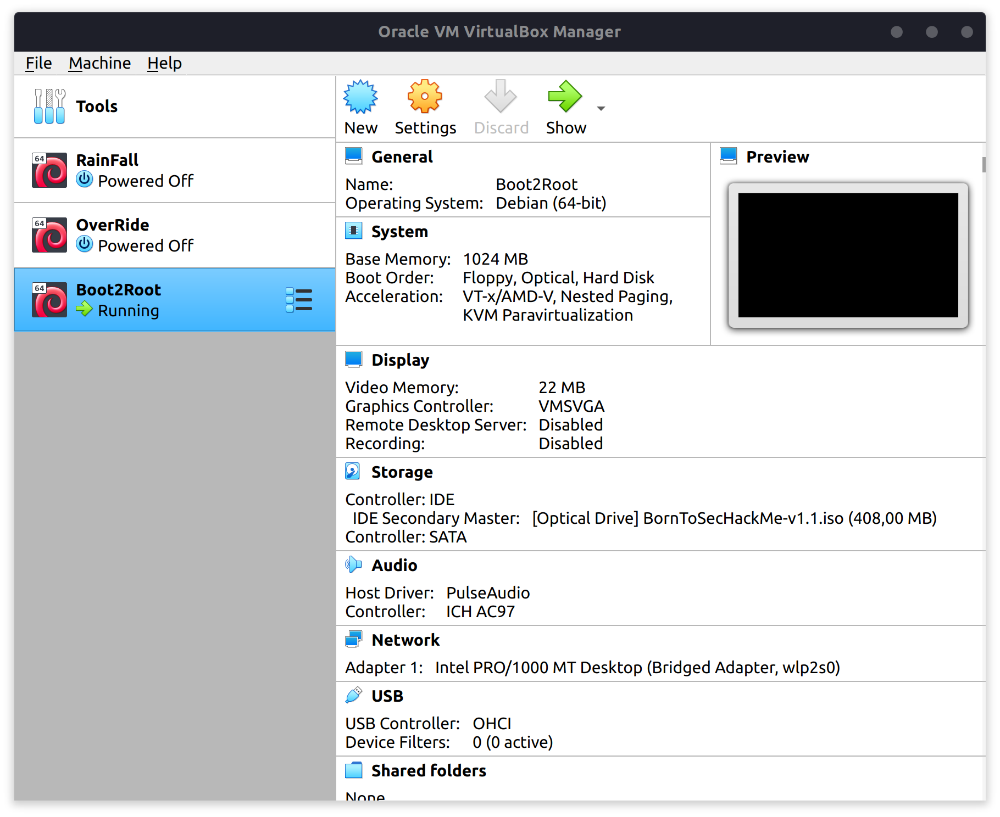

# Boot2Root

## Obtaining IP address of the virtual machine, and it's open ports

First, we need to find what our `Bridged Adaptor` name is.



Here, it's `wlp2s0`

Now we would like to know the ip address of this interface:

```sh
ip a | grep -A 2 wlp2s0:
2: wlp2s0: <BROADCAST,MULTICAST,UP,LOWER_UP> mtu 1500 qdisc noqueue state UP group default qlen 1000
    link/ether 14:4f:8a:04:eb:5b brd ff:ff:ff:ff:ff:ff
    inet 192.168.1.40/24 brd 192.168.1.255 scope global dynamic noprefixroute wlp2s0
```

With this information between our hands, we will get the IP adresses behind this interface :

```sh
nmap -sn 192.168.1.40/24              
Starting Nmap 7.91 ( https://nmap.org ) at 2020-12-29 11:38 CET
...
Nmap scan report for 192.168.1.7
Host is up (0.0013s latency).
...
```

A couple of adresses show up, but only one is missing when the VM is shutdown. We will use it.

```sh
nmap 192.168.1.7                
Starting Nmap 7.91 ( https://nmap.org ) at 2020-12-29 11:40 CET
Nmap scan report for 192.168.1.7
Host is up (0.00018s latency).
Not shown: 994 closed ports
PORT    STATE SERVICE
21/tcp  open  ftp
22/tcp  open  ssh
80/tcp  open  http
143/tcp open  imap
443/tcp open  https
993/tcp open  imaps

Nmap done: 1 IP address (1 host up) scanned in 0.17 seconds
```

## Discovering website tree structure
