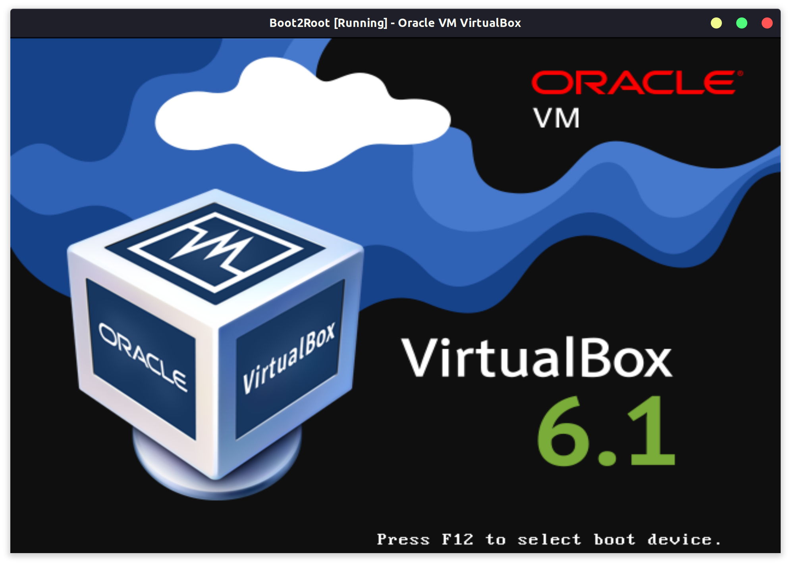
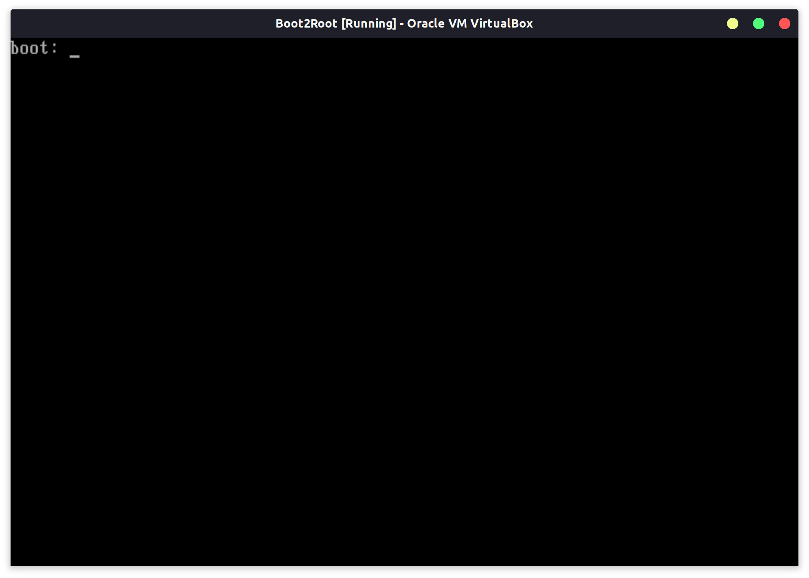
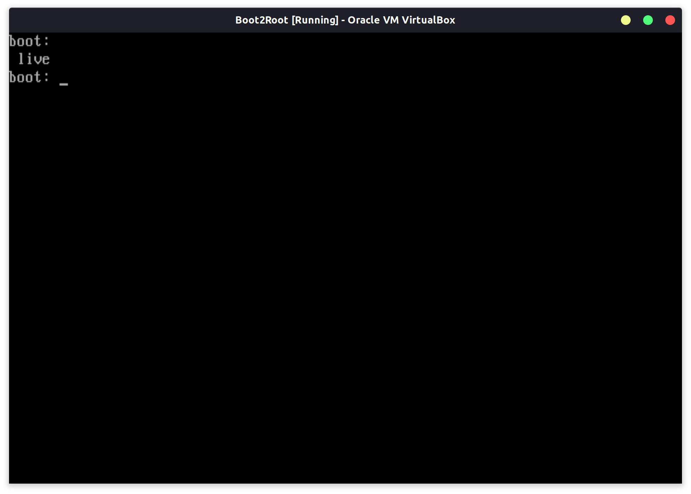
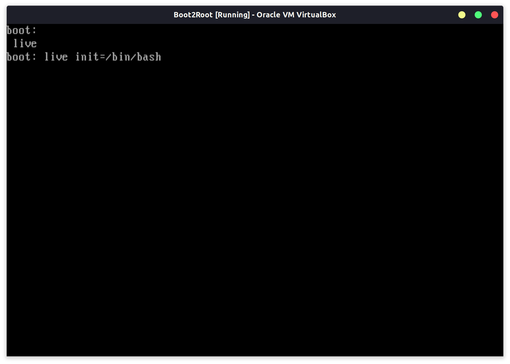
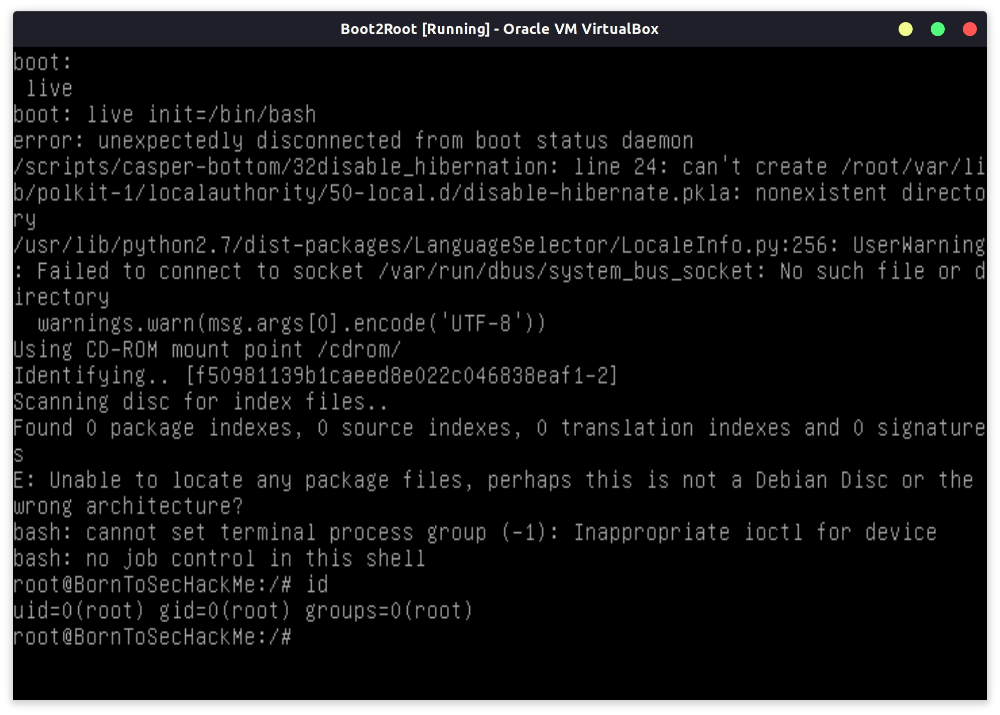

# live init

 0. When starting the VM we want to maintain `Shift`:
  
 1. We arrive to this prompt, which is the boot menu:
  
 2. Pressing `Tab` gets us our different booting options:
  
 3. We choose live, but we give the instruction to change init destination to `/bin/bash` so we have access to root shell:
  
 4. We can now verify our level of privileges wit `id`, we are root:
  
